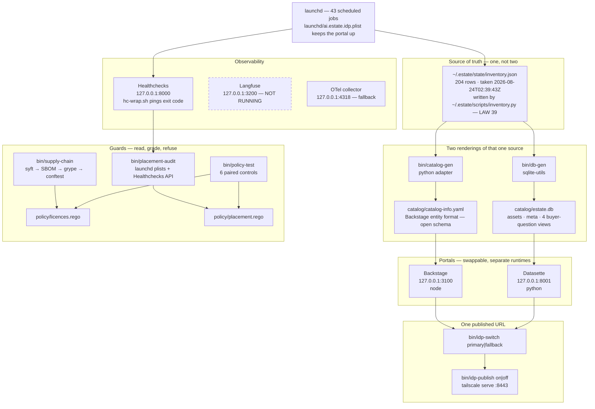
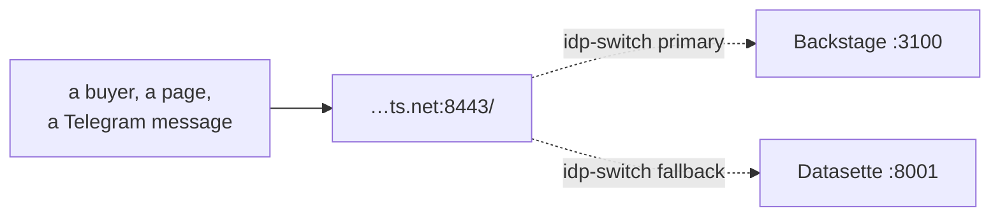
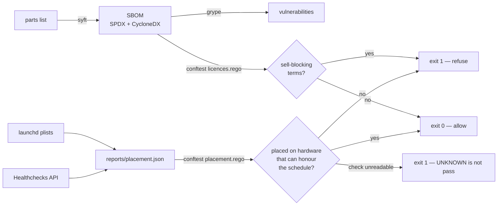

# The platform, drawn

Owner: chidionyema. Last verified 2026-08-24 by the commands at the bottom of this file.

One rule explains the whole shape: **the catalogue is the asset, the portal is a renderer.**
Everything below follows from that. If a renderer is wrong in a year, it is replaced and the
estate does not move.

## The whole platform



## The 10-second switch, and why the fallback is real

A fallback that shares the primary's runtime is not a fallback — one bad node install takes
both. So Backstage is node and Datasette is python, they run as separate processes on separate
ports, and both are up at all times. The switch only exists for the case where a link has
already been handed to somebody.



The zero-second switch needs no command: both renderers are already listening on their own
ports, so the answer to "Backstage is broken" is to open the other link.

## Where each guard sits in the flow



The `check unreadable` branch is the one that was missing until 2026-08-24. In Rego,
`null.last_ping` is *undefined* rather than null, so a rule reading `job.check.last_ping == null`
silently stops matching when the check record is null — and the guard gets quieter at the exact
moment it goes blind. `policy/fixtures/placement-blind.json` exists so that can never pass again.

## Ports and commands

| What | Port | Runtime | Start | State |
|---|---|---|---|---|
| Backstage — primary portal | 127.0.0.1:3100 | node | `bin/idp-up` | HTTP 200 |
| Datasette — fallback portal | 127.0.0.1:8001 | python | `bin/idp-up` | HTTP 200 |
| published URL | …ts.net:8443 | tailscale serve | `bin/idp-publish on` | tailnet only |
| Healthchecks — schedule monitor | 127.0.0.1:8000 | docker | estate | HTTP 000 — see below |
| Langfuse — LLM traces | 127.0.0.1:3200 | docker | `bin/langfuse-up` | not running |
| OTel collector — trace fallback | 127.0.0.1:4318 | docker | `bin/langfuse-up` | up, HTTP 000 |

Port 3000 is deliberately not used: it is held by `prospector-store-web`. That collision is
crew#87.

**Everything in the Docker column is unreachable as of 2026-08-24 03:15Z, and the cause is not
in this repo.** The Colima VM has 4 CPUs and was measured at load average 24.68 with 54 zombie
processes and 47.9% system time. Memory is not the constraint — 5,987 MB of 7,939 free. Nothing
in the VM can be scheduled, so containers Docker reports as `healthy` return HTTP 000, including
`prospector-store-web`. Verified from inside the VM as well as from the host, so it is not port
forwarding. Filed as crew#85.

This is why Langfuse is "not running" rather than "broken". Langfuse is Postgres, ClickHouse,
Redis, MinIO, web and worker. `docker compose up -d` ran for ten minutes on that VM and created
zero containers. The two renderers above are unaffected because neither is in Docker — Backstage
is node and Datasette is python, both on the host. That separation was designed for a different
failure and it is the reason the portal is still serving.

## What is deliberately not here

- **No bespoke inventory.** `bin/catalog-gen` and `bin/db-gen` are adapters over an inventory
  LAW 39 already produces. Nothing about the estate is stored in this repo.
- **No bespoke test harness.** `bin/policy-test` runs conftest, because the tool that runs the
  policy in anger is the tool that should run it in test.
- **No bespoke SBOM format.** syft emits SPDX and CycloneDX, both of which carry their own
  schema and provenance inside the file.

## One fact still in two places

`bin/catalog-gen` and `bin/db-gen` each compute `licence_file` by checking the same five
filenames, because the inventory does not record it. That is one fact with two implementations
and it will drift. The fix is a `licence_file` field in the inventory itself; until it lands,
both readers agree only because both were written on the same day.

## Verify every claim on this page

```
curl -s -o /dev/null -w '%{http_code}\n' http://127.0.0.1:3100      # 200
curl -s -o /dev/null -w '%{http_code}\n' http://127.0.0.1:8001      # 200
jq '.rows|length' ~/.estate/state/inventory.json                     # 204
sqlite3 catalog/estate.db 'select count(*) from assets;'             # 204
sqlite3 catalog/estate.db 'select * from meta;'                      # which run produced this
bin/idp-verify                                                       # both renderers agree
bin/policy-test                                                      # 6 fixtures, exit 0
bin/supply-chain                                                     # SBOM + licence gate
bin/placement-audit                                                  # inventory + placement gate
```

The inventory and the catalogue join exactly. When the two counts differ it is a snapshot-time
difference, not a second silo — on 2026-08-24 the catalogue held one extra row, `zz.probe.badxml`,
because its snapshot was taken 44 seconds earlier. Check `meta.taken_at` before concluding
anything from a count gap.

## How the catalogue reaches the renderer, and the bug that was in it

`bin/db-gen` used to publish each regeneration with `mv "$tmp" "$DB"`. Datasette holds the
database open for the life of the process, so `mv` put a new inode at the path and left the
running renderer reading the old, deleted one. The fallback portal served 194 rows for hours
while the file on disk held 204, and nothing errored — a renderer serving stale data looks
exactly like a renderer serving fresh data. Fixed 2026-08-24 in `b06d05c`: publishing now goes
through SQLite's online backup API, which writes into the existing file under a writer's locks,
so the open reader keeps its handle and reloads.

The class of mistake is wider than this file: **publishing by replacing an inode while a
long-lived reader holds it open.** `catalog/catalog-info.yaml` is safe because Backstage re-reads
it on a poll rather than holding it open. Anywhere else that writes to a temp file and moves it
over a path some daemon has open has this bug.

`bin/idp-verify` is the guard that catches it. It compares what each renderer serves over HTTP
against the source, and exits 1 when they disagree.
