# Live estate

GENERATED by `bin/estate-diagram` from `catalog/catalog-info.yaml`, inventory taken 2026-08-26T02:06:43Z. Do not edit: the next render overwrites it. Regenerate with `make diagrams`; `bin/estate-diagram --check` fails when this page and the catalogue disagree.

21 repositories, 55 scheduled jobs, 37 guards, 119 ledgers, 37 listening ports, 15 drills.

```mermaid
flowchart LR
  n_QAlgo["QAlgo<br/>0 jobs · 0 guards · 0 ledgers"]
  n_agent_guard["agent-guard<br/>1 jobs · 0 guards · 0 ledgers"]
  n_claude["claude<br/>22 jobs · 25 guards · 113 ledgers"]
  n_crew["crew<br/>3 jobs · 0 guards · 0 ledgers"]
  n_ebookStore["ebookStore<br/>0 jobs · 0 guards · 0 ledgers"]
  n_ecommerce_clean["ecommerce-clean<br/>0 jobs · 0 guards · 0 ledgers"]
  n_ecommerce_frontend["ecommerce-frontend<br/>0 jobs · 0 guards · 0 ledgers"]
  n_estate["estate<br/>4 jobs · 12 guards · 5 ledgers"]
  n_estate_secrets["estate-secrets<br/>0 jobs · 0 guards · 0 ledgers"]
  n_front_door_catalogue["front-door-catalogue<br/>0 jobs · 0 guards · 0 ledgers"]
  n_front_door_login["front-door-login<br/>0 jobs · 0 guards · 0 ledgers"]
  n_hermes["hermes<br/>8 jobs · 0 guards · 0 ledgers"]
  n_hermes_v2_ARCHIVED_20260822["hermes-v2.ARCHIVED.20260822<br/>0 jobs · 0 guards · 0 ledgers"]
  n_lux["lux<br/>0 jobs · 0 guards · 0 ledgers"]
  n_popdd_py["popdd-py<br/>0 jobs · 0 guards · 0 ledgers"]
  n_popdd_ts["popdd-ts<br/>0 jobs · 0 guards · 0 ledgers"]
  n_prospector["prospector<br/>2 jobs · 0 guards · 0 ledgers"]
  n_prospector_live["prospector-live<br/>2 jobs · 0 guards · 0 ledgers"]
  n_sentinel_loop["sentinel-loop<br/>0 jobs · 0 guards · 0 ledgers"]
  n_signalengine["signalengine<br/>0 jobs · 0 guards · 0 ledgers"]
  n_vault_201["vault-201<br/>0 jobs · 0 guards · 0 ledgers"]
  n_port_53[/"port-53 · limactl · *"/]
  n_port_53 --> n_outside
  n_port_3000[/"port-3000 · prospector-store-web · 127.0.0.1"/]
  n_port_3000 --> n_outside
  n_port_3101[/"port-3101 · catalogue · 127.0.0.1"/]
  n_port_3101 --> n_outside
  n_port_3101_outside[/"port-3101-outside · catalogue · [::1]"/]
  n_port_3101_outside --> n_outside
  n_port_3210[/"port-3210 · dagster-webserver · 127.0.0.1"/]
  n_port_3210 --> n_outside
  n_port_3310[/"port-3310 · mcp-agentgateway · 127.0.0.1"/]
  n_port_3310 --> n_outside
  n_port_4000[/"port-4000 · litellm-proxy · 127.0.0.1"/]
  n_port_4000 --> n_outside
  n_port_5000[/"port-5000 · ControlCenter · *"/]
  n_port_5000 --> n_outside
  n_port_5291[/"port-5291 · prospector-store-api · 127.0.0.1"/]
  n_port_5291 --> n_outside
  n_port_5432[/"port-5432 · postgres · 127.0.0.1"/]
  n_port_5432 --> n_outside
  n_port_5432_outside[/"port-5432-outside · postgres · [::1]"/]
  n_port_5432_outside --> n_outside
  n_port_7000[/"port-7000 · ControlCenter · *"/]
  n_port_7000 --> n_outside
  n_port_7107[/"port-7107 · nodeTransform.cjs · 127.0.0.1"/]
  n_port_7107 --> n_outside
  n_port_7233[/"port-7233 · temporal · 127.0.0.1"/]
  n_port_7233 --> n_estate
  n_port_8000[/"port-8000 · node · *"/]
  n_port_8000 --> n_outside
  n_port_8080[/"port-8080 · prospector-edge · 127.0.0.1"/]
  n_port_8080 --> n_outside
  n_port_8443[/"port-8443 · prospector-edge · 127.0.0.1"/]
  n_port_8443 --> n_outside
  n_port_8611[/"port-8611 · prospector-engine · 127.0.0.1"/]
  n_port_8611 --> n_outside
  n_port_8765[/"port-8765 · consultd.py · 127.0.0.1"/]
  n_port_8765 --> n_claude
  n_port_8766[/"port-8766 · kimi_bridge.py · 127.0.0.1"/]
  n_port_8766 --> n_claude
  n_port_8767[/"port-8767 · kimi_bridge.py · 127.0.0.1"/]
  n_port_8767 --> n_claude
  n_port_8787[/"port-8787 · board_serve.py · 127.0.0.1"/]
  n_port_8787 --> n_claude
  n_port_8788[/"port-8788 · python3.10 · 127.0.0.1"/]
  n_port_8788 --> n_outside
  n_port_8799[/"port-8799 · run_demo_cockpit.py · 127.0.0.1"/]
  n_port_8799 --> n_outside
  n_port_9000[/"port-9000 · cli.js · *"/]
  n_port_9000 --> n_outside
  n_port_11434[/"port-11434 · ollama · 127.0.0.1"/]
  n_port_11434 --> n_outside
  n_port_49250[/"port-49250 · rapportd · *"/]
  n_port_49250 --> n_outside
  n_port_49385[/"port-49385 · Ollama · 127.0.0.1"/]
  n_port_49385 --> n_outside
  n_port_49579[/"port-49579 · cli.js · *"/]
  n_port_49579 --> n_outside
  n_port_49919[/"port-49919 · llama-server · 127.0.0.1"/]
  n_port_49919 --> n_outside
  n_port_50397[/"port-50397 · llama-server · 127.0.0.1"/]
  n_port_50397 --> n_outside
  n_port_52037[/"port-52037 · temporal · 127.0.0.1"/]
  n_port_52037 --> n_estate
  n_port_52038[/"port-52038 · temporal · 127.0.0.1"/]
  n_port_52038 --> n_estate
  n_port_52039[/"port-52039 · temporal · 127.0.0.1"/]
  n_port_52039 --> n_estate
  n_port_52040[/"port-52040 · temporal · 127.0.0.1"/]
  n_port_52040 --> n_estate
  n_port_52041[/"port-52041 · temporal · 127.0.0.1"/]
  n_port_52041 --> n_estate
  n_port_64676[/"port-64676 · limactl · 127.0.0.1"/]
  n_port_64676 --> n_outside
  n_outside["(process outside every checkout)"]
```

## Scheduled jobs

| job | every | last status | loaded | belongs to |
|---|---|---|---|---|
| ai.aiden.watch | 4 min | clean | True | claude |
| ai.architect.gateway |  | clean | True |  |
| ai.estate.agent-guard-lint | calendar s | signal 1 | True | agent-guard |
| ai.estate.cockpit |  | clean | True |  |
| ai.estate.consultd |  | clean | True | claude |
| ai.estate.deepseek-bridge |  | clean | True | claude |
| ai.estate.dep-alerts | calendar s | clean | True | claude |
| ai.estate.drills | calendar s | clean | True | claude |
| ai.estate.friction-relay | 9 min | clean | True | claude |
| ai.estate.idp | 60 min | clean | True |  |
| ai.estate.key-escrow | calendar s | clean | True | claude |
| ai.estate.kimi-bridge |  | clean | True | claude |
| ai.estate.law-writer | calendar s | clean | True | claude |
| ai.estate.scheduler | 10 min | clean | True |  |
| ai.estate.sovereign-worker |  | signal 1 | True |  |
| ai.estate.temporal |  | clean | True |  |
| ai.estate.tracked-guard | 29 min | clean | True | claude |
| ai.hermes.gateway |  | not loaded | False |  |
| ai.hermes.runaway-reaper | 5 min | clean | True | hermes |
| com.adobe.ccxprocess | calendar s | not loaded | False |  |
| com.chidionyema.graphify-sweep | calendar s | signal 1 | True | prospector |
| com.chidionyema.guard-selftest | calendar s | signal 1 | True | claude |
| com.chidionyema.maestro |  | clean | True |  |
| com.chidionyema.reflect | calendar s | clean | True | hermes |
| com.estate.bundlepush | calendar s | signal 2 | True | claude |
| com.estate.costsentinel | 14 min | signal 1 | True | claude |
| com.estate.downshift | 15 min | clean | True | claude |
| com.estate.inventory | calendar s | clean | True | estate |
| com.estate.restic-backup | calendar s | clean | True | claude |
| com.founder.agentcert | calendar s | clean | True | estate |
| com.founder.board | calendar s | signal 1 | True | claude |
| com.founder.boardserve |  | clean | True | claude |
| com.founder.configsyntaxsweep | calendar s | clean | True | claude |
| com.founder.estate-awake |  | clean | True |  |
| com.founder.estateaudit | calendar s | clean | True | claude |
| com.founder.estatelander | calendar s | clean | True | crew |
| com.founder.estatepush | calendar s | clean | True | claude |
| com.founder.estatesnapshot | calendar s | signal 1 | True | crew |
| com.founder.estatewatch | 30 min | clean | True | claude |
| com.founder.ingit | calendar s | signal 1 | True | estate |
| com.founder.lawenforcement | calendar s | signal 1 | True | estate |
| com.founder.sciencecollect | calendar s | signal 1 | True | crew |
| com.founder.stuckdetector | 5 min | clean | True | claude |
| com.prospector-control.failover-watch | 1 min | clean | True |  |
| com.prospector-control.receipt-bridge | 15 min | clean | True | hermes |
| com.prospector.backup | calendar s | clean | True | hermes |
| com.prospector.estate-inventory | calendar s | clean | True | hermes |
| com.prospector.launchd-held | calendar s | signal 1 | True | hermes |
| com.prospector.log-rotation | calendar s | clean | True | prospector-live |
| com.prospector.offsite-backup | calendar s | clean | True | prospector-live |
| com.prospector.process-audit | calendar s | signal 1 | True | hermes |
| com.prospector.restore-drill | calendar s | clean | True | hermes |
| com.prospector.scheduler |  | clean | True | prospector |
| com.valvesoftware.steamclean |  | signal 78 | True |  |
| homebrew.mxcl.postgresql-17 |  | clean | True |  |
