# Live estate

GENERATED by `bin/estate-diagram` from `catalog/catalog-info.yaml`, inventory taken 2026-08-28T00:13:43Z. Do not edit: the next render overwrites it. Regenerate with `make diagrams`; `bin/estate-diagram --check` fails when this page and the catalogue disagree.

25 repositories, 13 scheduled jobs, 40 guards, 170 ledgers, 20 listening ports, 17 drills.

```mermaid
flowchart LR
  n_QAlgo["QAlgo<br/>0 jobs · 0 guards · 0 ledgers"]
  n_agent_guard["agent-guard<br/>0 jobs · 0 guards · 0 ledgers"]
  n_claude["claude<br/>5 jobs · 28 guards · 162 ledgers"]
  n_crew["crew<br/>0 jobs · 0 guards · 0 ledgers"]
  n_estate["estate<br/>0 jobs · 12 guards · 7 ledgers"]
  n_front_door_catalogue["front-door-catalogue<br/>0 jobs · 0 guards · 0 ledgers"]
  n_front_door_healthchecks["front-door-healthchecks<br/>0 jobs · 0 guards · 0 ledgers"]
  n_front_door_healthchecks_ping["front-door-healthchecks-ping<br/>0 jobs · 0 guards · 0 ledgers"]
  n_front_door_langfuse["front-door-langfuse<br/>0 jobs · 0 guards · 0 ledgers"]
  n_front_door_langfuse_api["front-door-langfuse-api<br/>0 jobs · 0 guards · 0 ledgers"]
  n_front_door_litellm["front-door-litellm<br/>0 jobs · 0 guards · 0 ledgers"]
  n_front_door_login["front-door-login<br/>0 jobs · 0 guards · 0 ledgers"]
  n_front_door_mcp["front-door-mcp<br/>0 jobs · 0 guards · 0 ledgers"]
  n_front_door_otlp_ingest["front-door-otlp-ingest<br/>0 jobs · 0 guards · 0 ledgers"]
  n_front_door_signoz["front-door-signoz<br/>0 jobs · 0 guards · 0 ledgers"]
  n_hermes_v2_ARCHIVED_20260822["hermes-v2.ARCHIVED.20260822<br/>0 jobs · 0 guards · 0 ledgers"]
  n_interfaces["interfaces<br/>0 jobs · 0 guards · 0 ledgers"]
  n_lux["lux<br/>0 jobs · 0 guards · 0 ledgers"]
  n_popdd_py["popdd-py<br/>0 jobs · 0 guards · 0 ledgers"]
  n_popdd_ts["popdd-ts<br/>0 jobs · 0 guards · 0 ledgers"]
  n_prospector["prospector<br/>0 jobs · 0 guards · 0 ledgers"]
  n_prospector_live["prospector-live<br/>0 jobs · 0 guards · 0 ledgers"]
  n_sentinel_loop["sentinel-loop<br/>0 jobs · 0 guards · 0 ledgers"]
  n_signalengine["signalengine<br/>0 jobs · 0 guards · 0 ledgers"]
  n_vault_201["vault-201<br/>0 jobs · 0 guards · 0 ledgers"]
  n_port_3100[/"port-3100 · backstage-cli · 127.0.0.1"/]
  n_port_3100 --> n_outside
  n_port_3210[/"port-3210 · dagster-webserver · 127.0.0.1"/]
  n_port_3210 --> n_outside
  n_port_5000[/"port-5000 · ControlCenter · *"/]
  n_port_5000 --> n_outside
  n_port_5432[/"port-5432 · postgres · 127.0.0.1"/]
  n_port_5432 --> n_outside
  n_port_5432_outside[/"port-5432-outside · postgres · [::1]"/]
  n_port_5432_outside --> n_outside
  n_port_7000[/"port-7000 · ControlCenter · *"/]
  n_port_7000 --> n_outside
  n_port_7233[/"port-7233 · temporal · 127.0.0.1"/]
  n_port_7233 --> n_estate
  n_port_8765[/"port-8765 · consultd.py · 127.0.0.1"/]
  n_port_8765 --> n_claude
  n_port_8766[/"port-8766 · kimi_bridge.py · 127.0.0.1"/]
  n_port_8766 --> n_claude
  n_port_8767[/"port-8767 · kimi_bridge.py · 127.0.0.1"/]
  n_port_8767 --> n_claude
  n_port_8787[/"port-8787 · board_serve.py · 127.0.0.1"/]
  n_port_8787 --> n_claude
  n_port_8788[/"port-8788 · python3.10 · 127.0.0.1"/]
  n_port_8788 --> n_outside
  n_port_11434[/"port-11434 · ollama · 127.0.0.1"/]
  n_port_11434 --> n_outside
  n_port_49211[/"port-49211 · rapportd · *"/]
  n_port_49211 --> n_outside
  n_port_49214[/"port-49214 · temporal · 127.0.0.1"/]
  n_port_49214 --> n_estate
  n_port_49215[/"port-49215 · temporal · 127.0.0.1"/]
  n_port_49215 --> n_estate
  n_port_49216[/"port-49216 · temporal · 127.0.0.1"/]
  n_port_49216 --> n_estate
  n_port_49217[/"port-49217 · temporal · 127.0.0.1"/]
  n_port_49217 --> n_estate
  n_port_49218[/"port-49218 · temporal · 127.0.0.1"/]
  n_port_49218 --> n_estate
  n_port_49862[/"port-49862 · Ollama · 127.0.0.1"/]
  n_port_49862 --> n_outside
  n_outside["(process outside every checkout)"]
```

## Scheduled jobs

| job | every | last status | loaded | belongs to |
|---|---|---|---|---|
| ai.estate.cockpit |  | running | True |  |
| ai.estate.consultd |  | running | True | claude |
| ai.estate.deepseek-bridge |  | running | True | claude |
| ai.estate.kimi-bridge |  | running | True | claude |
| ai.estate.scheduler | 10 min | running | True |  |
| ai.estate.session-timeout | 5 min | clean | True |  |
| ai.estate.sovereign-worker |  | running | True |  |
| ai.estate.temporal |  | running | True |  |
| com.chidionyema.maestro |  | running | True |  |
| com.founder.boardserve |  | running | True | claude |
| com.founder.estate-awake |  | running | True |  |
| com.prospector-control.receipt-bridge | 15 min | clean | True | claude |
| homebrew.mxcl.postgresql-17 |  | running | True |  |
