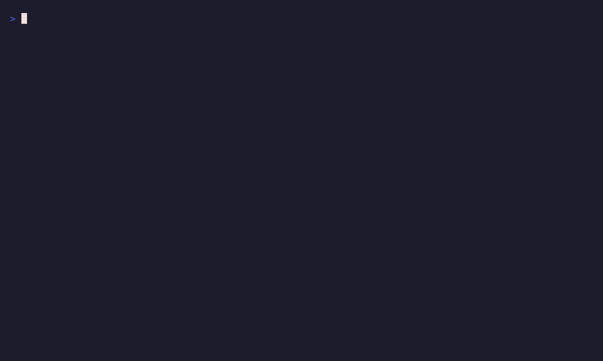

# Boardroom dashboards from LLM traces

Metabase reads Langfuse data and lets the founder build dashboards and explore traces interactively: drill down by prompt, model, cost, latency or any field in the trace, save queries, share charts with the team.

## See it work

1. Sign in to Metabase at https://metabase.${ESTATE_ZONE} with your estate login.
2. Click "New" and then "Question" to create a new query.
3. Select "Langfuse" as the database (you may need to configure it the first time — the connection uses localhost:5432, user postgres, database langfuse, password in the vault).
4. Pick a table, for example "events" to see individual trace calls.
5. Add filters for date, model, or cost range, and click "Visualize" to see the data.
6. Save the question and add it to a dashboard.

## What it proves

The dashboard connects to the live Langfuse database and reads trace data without a separate pipeline. Every call through the router is immediately queryable: no latency, no batch job, the same data Langfuse shows, with the flexibility to group, filter and chart however the founder needs.

## Watch it

The machines record the dashboard layer's declaration from the real manifests on
every relevant push (`demos/metabase.tape`): the five files, the public door behind
the one estate login, and the declared floor that survives losing a node. The
recording appears after the first green render and refreshes itself:

