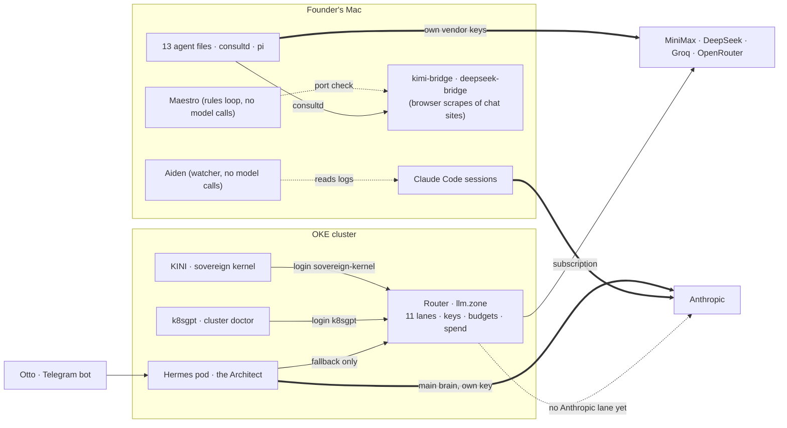
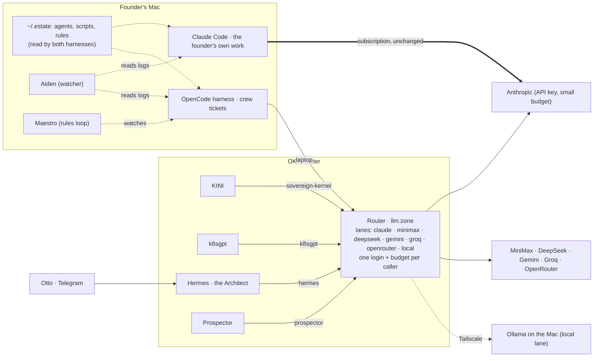

# AI model stack: who asks which model, through which door

Measured 2026-08-29 (crew#568). This page is the one place that says, for every agent and product on the estate, where its AI calls go today and where they go after the migration in crew#617.

## The five things, one sentence each

- **The router.** One service in the cluster at `llm.<zone>` (LiteLLM). The estate's single front door for AI: it holds the vendor keys, maps a *lane* to a vendor, falls back when a vendor fails, records the cost and caps each caller's budget. Console: `llm.<zone>/ui`, estate sign-in.
- **KINI** (the sovereign kernel). The durable workflow engine (Temporal) that runs long jobs. When a job needs a model it asks the router with the login `sovereign-kernel`. On the stack.
- **k8sgpt** (the cluster doctor). Reads Kubernetes events, asks a model to explain a failure. Login `k8sgpt`. On the stack.
- **Hermes / the Architect / Otto.** One agent, three names. *Otto* is the Telegram bot account, the doorway. *The Architect* is the persona that answers. *Hermes* is the runtime it runs on, a pod in the cluster. Its main brain goes to Anthropic directly on its own key (`hermes-v2/config.yaml:2,50`); only its fallback goes through the router (`config.yaml:12`). Half on the stack.
- **Claude Code.** The coding harness on the founder's Mac. It runs on a Claude subscription (`~/.claude.json` billingType `stripe_subscription`), straight to Anthropic. A subscription is not an API key, so it cannot go through the router. Off the stack, by design.
- **Aiden.** A watcher on the Mac that reads Claude Code session logs and scores them (`~/.claude/scripts/aiden/aiden.py:5`: "nothing in this program asks a model anything"). No relationship to the router.
- **Maestro.** A rules loop on the Mac under launchd (`com.chidionyema.maestro`, `maestro/maestro.py`) that watches the estate, restarts what it can and pages the founder in the Otto chat. It asks no model: its only contact with AI is a port check that the two bridges and Ollama are up (`maestro.py:1313`). No relationship to the router.
- **The two "bridges" (kimi-bridge, deepseek-bridge).** Not APIs. `~/.claude/scripts/kimi_bridge.py` drives a signed-in chat website through a browser (Playwright) and serves it on a local port for `consultd` and `bin/consult`. A buyer's engineer would take this apart in one sitting: it is a scraped consumer chat, not a vendor contract, with no key, no budget and no receipt. Both are retired in phase 2 in favour of the router's `openrouter` and `deepseek` lanes.

## Today

Thick lines are where nearly all the money goes. The router has spent $0.0037 across 351 calls in its life; the direct roads carry everything else (Claude Code alone: $850 of API-equivalent tokens on 2026-08-29).

## After the migration (crew#617 phases 1 to 5)

Every caller except Claude Code goes through the one door. Claude Code is the deliberate exception: it is the founder's subscription, it stays as it is, and it is the one road the console cannot see; the portal card shows its meter beside the router's bill instead.

## Who is where

| Caller | Runs on | Today | After | Login on the router |
|---|---|---|---|---|
| KINI (sovereign kernel) | cluster (Temporal) | on | on | `sovereign-kernel` |
| k8sgpt (cluster doctor) | cluster | on | on | `k8sgpt` |
| Hermes / Architect behind Otto | cluster | half (fallback only) | on | `hermes` (phase 5) |
| Prospector | cluster | off | on | `prospector` (phase 5) |
| OpenCode harness (crew tickets) | Mac | not yet the harness | on | `laptop` (phase 0) |
| 13 agent files, consultd, pi | Mac | off, own keys | on via `laptop` | `laptop` (phases 2, 4) |
| Claude Code | Mac | off (subscription) | off, by design | none |
| Aiden | Mac | no model | no model | none |
| Maestro | Mac | no model | no model | none |
| kimi-bridge, deepseek-bridge (browser scrapes) | Mac | off, no key at all | retired (phase 2) | none |

## The unified, vendor-agnostic model in plain terms

*Vendor-agnostic* means no agent knows or cares which company's model answers it. An agent names a **lane** (`claude`, `minimax`, `local`), never a vendor. The router maps the lane to a vendor, and that mapping is changed in the console with no code change and no agent restart. *Unified* means there is one such door: one set of vendor keys, one bill, one place to cap spend, one place to switch a model off.

The rule that makes it hold: an agent file, a product config or a script that names a vendor is refused by CI (crew#617 phases 4 and 6). The only file that may name a vendor is the router's own config, `platform/llm/config.yaml`.

## What is not perfect, said once

- Claude Code cannot join the router. The subscription is the ceiling on that road and the router only shows what it sees. Phase 3 measures one ticket on MiniMax against the same ticket on Claude; that number decides how much crew work moves.
- Some things do not port between vendors (crew#122): tool schemas, thinking blocks, prompt caching. Measured in phase 3 before anything is enforced.
- The `local` lane depends on the Mac being awake; it falls back to `minimax`.

## Receipts

Spend by caller and lane: `gh workflow run oke-check.yml -f mode=break-glass -f playbook=router-spend`. Plan and rollback: crew#617 (`crew/docs/specs/issue-568.md`). Sources: `platform/llm/config.yaml`; `hermes-v2/config.yaml`; `hermes-v2/SOUL.md`.
