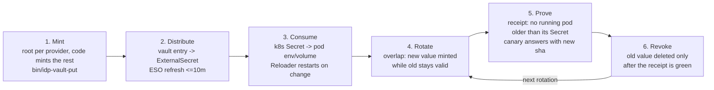

# The life of a secret in this estate

Every secret travels one road. Each stage below names the thing that PROVES it happened and
the thing that SCREAMS when it did not. A stage with no receipt and no alarm does not exist
(LAW 28). Founder request 2026-08-31 (crew#722 comment 5472793578): a rigorous lifecycle
document with a diagram, strongly audited and monitored at every stage.

## Per-stage audit and monitoring

| Stage | What happens | Audited by (the receipt) | Monitored by (the alarm) | Status |
|---|---|---|---|---|
| 1. Mint | One root credential per provider (R52); every other credential is minted by code (`bin/idp-vault-put`, seed scripts). No console steps, no values in chat or logs. | Git history of the minting code; the vault entry's own update stamp. | credential-guard refuses secret values in any PR body or reply; rule-guard refuses console-step instructions. | LIVE |
| 2. Distribute | The vault entry becomes a cluster Secret through an ExternalSecret (refreshInterval <=10m). | Receipt row per ExternalSecret: Ready condition AND `last_sync` (crew#406, crew#387). | Grader FAILS the estate receipt when Ready is false OR last_sync is older than 2x refreshInterval (floor 2h) — a controller that silently stops refreshing goes red. | LIVE |
| 3. Consume | Pods mount the Secret (env or volume); Reloader restarts consumers when the Secret changes. `reloader.stakater.com/auto: "true"` is the estate standard. | Receipt row `secret_stale_consumers` (crew#722): every Running pod is compared against max(managedFields time) of every Secret it consumes, 900s grace. | Grader FAILS on any count > 0 (names pod and Secret), on -1 (metadata unreadable — BLIND is never green), and on a receipt that predates the row. Collector RBAC is list-only metadata: a secret VALUE read is not even expressible. | LIVE (PR 1029) |
| 4. Rotate | Overlap-then-revoke: the new value is minted while the old stays valid; ESO distributes; Reloader rolls consumers. Zero downtime because both values are valid during the roll. | The canary drill's run log: vault write stamp -> pod answer stamp. | Drill `rotation-canary` (daily 06:17Z): rotates a REAL vault entry, waits for a running pod to publish the sha of the value it holds. SLO 1500s vault-to-pod. `drills/catalogue.yaml` greys to red within 26h of a missing run. | LIVE (PR 1029) |
| 5. Prove | A rotation is DONE only when the running program answers with the new value — never when the vault write succeeds. | `secret_stale_consumers=0` on the estate receipt + the canary's published `sha256=...` line in the drill bucket. | Both graded every cycle: receipt each 15 min, drill daily. Two independent angles (LAW 15): the fleet-wide metadata compare and the end-to-end value round-trip. | LIVE (PR 1029) |
| 6. Revoke | The old value is deleted from the provider only after stage 5 is green for the affected consumers. | PLANNED (CP6): revocation gated on the receipt, logged with the receipt row it read. | PLANNED (CP6): automated overlap-then-revoke; until then revocation is manual and the gap is named here, not hidden. | PLANNED |

## Planned waves (tracked on crew#722)

- **CP4 — ownership and maximum age:** every secret gets an owner and a max age; the receipt
  goes red when a secret is overdue for rotation, before anything breaks.
- **CP5 — value-shape check at write:** `bin/idp-vault-put` refuses a value that does not
  match the entry's declared shape (an unusable key mounted green was crew#684's incident).
- **CP6 — automated overlap-then-revoke:** the full stage-4-to-6 road with no hand, revoke
  gated on the stage-5 receipt.

## The two incidents this design answers

- crew#506 CP4: a vault write succeeded, the pod kept the old value, found by a person.
- crew#684: a key was mounted green but unusable; nothing exercised the road end to end.

Both are now impossible to miss: stage 3's receipt row catches the pod that never rolled,
stage 4's canary catches the road that silently broke, and neither depends on a person
opening a door.
